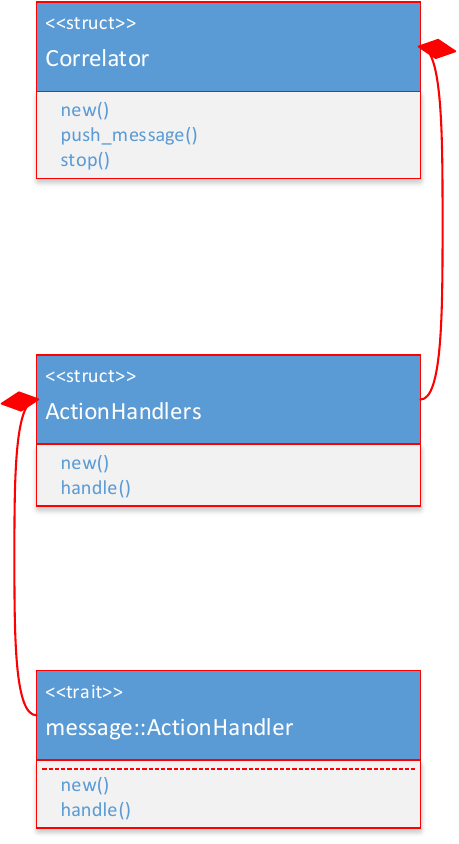
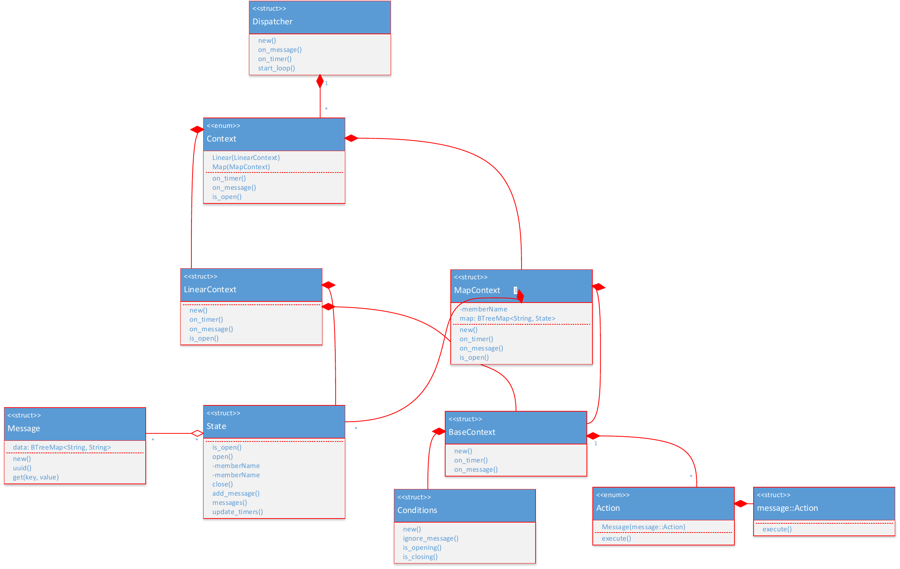

# Proposal about the new correlation parser
I would like to propose a new correlation parser for syslog-ng which can replace
the correlation feature in PatternDB.

## Causes
* correlation and parsing are not separated parsers
* correlation cannot be configured without parser
* lacks of some feature:
 * under sec timeout
 * max context size
 * 'global' timeout
 * context opener or closer pattern

## Proposal
I propose a Rust based correlation parser. Its advantages are:
* it's designed from scratch with simplicity in mind
* it tries to avoid the mistakes we learned from PatternDB
* it's independent from the other parsers like PatternDB or ActionDB
* it can be easily extended to run the correlation concurrently using threads

It is implemented as a Rust library which is used by a syslog-ng parser. We already
have one parser implemented in Rust so the bindings are ready.

## Architecture

### Components
The library has the following major components:
* `Correlator`: initializes the other components and starts the threads. It's connected to the `Dispatcher` and sends `Message` events to it through an asynchronous channel.
* `Timer`: periodically emits `TimerEvent`s which store the elapsed time. The events are sent to the `Dispatcher` through an asynchronous channel.
* `Dispatcher`: dispatches the events (`Message` or `Timer`)  to all `Context` instances
* `Context`: provides an interface to handle events (`Message` and `Timer`)
 * `BaseContext`: encapsulates all required fields what a context needs (name, uuid, conditions, etc.)
 * `LinearContext`: it groups messages only by their pattern uuid
 * `MapContext`: takes the hash of the message and groups by the messages by the hashes
* `Conditions`: encapsulates the conditions which needs to be checked to open or close a context
* `State`: represents the current state of a context (elapsed time, messages, is open?, etc.)
* `Action`: when a context is closed (specifically its `State`) actions can be executed. They can generate a command objects (`ExecResult`) which will be executed in the main thread (syslog-ng's source thread). The command object is generated by the `Action` enum.
 * `message::Action`: it can generate a `message::ExecResult` type which represents a message
* `ActionHandler`: the main thread when receives an `ExecResult` will can their corresponding `ActionHandler`
* `ActionHandlers`: strategy pattern, encapsulates all `ActionHandler` instances. This way the users of the library can specify their of handlers, like callbacks.

I'll define the minor types in the following sections.

#### Correlator

##### Responsibilities
* starts the worker threads (Timer, Dispatcher)
* forwards messages to the dispatcher
* executes the action handlers when it receives a command object from the dispatcher thread
* stops the threads

##### Dynamic behavior
1. Creation
* receives the configuration in its constructor (`new()`)
* starts the dispatcher:
 * creates its thread
 * creates a Dispatcher in the thread and passes the configuration to it
   * note: the configuration cannot contain trait object, because of the threads
 * starts the Dispatcher's loop (`start_loop()`)

2. Normal working
* receives messages via `push_message()` and sends it to the `Dispatcher`
* before every send checks the output channel from the `Dispatcher`
 * if there is any data available it reads it and invokes the registered `ActionHandler`

3. Stopping
* There are cases when messages can be lost in asynchronous channels (the other ends disconnects and there were buffered messages). This can be worked around:
 * `Correlator` sends an `Exit` command to the `Dispatcher`
 * the `Dispatcher` receives the `Exit` command and sends back and other one
 * the `Correlator` reads the messages from the channel till it receives back the `Exit` command and sends the second one
 * the `Dispatcher` stops looping when it receives the second `Exit`. Its thread gracefully dies.
 * this guarantees that we didn't lose any precious messages from the `Dispatcher`

#### Dispatcher

##### Responsibilities
Dispatches the events received from the `Correlator` on all context instances. So it delivers the messages and elapsed time events to all contexts. Delivers the execution results of the actions to the `Correlator`.

#### High level Architecture
Static + Dynamic

### Dynamic behavior
The library spawns two threads (at least):
* `Timer` has its own thread
* `Dispatcher` runs in its own thread

The threads are communicating through asynchronous channels. There are cases
